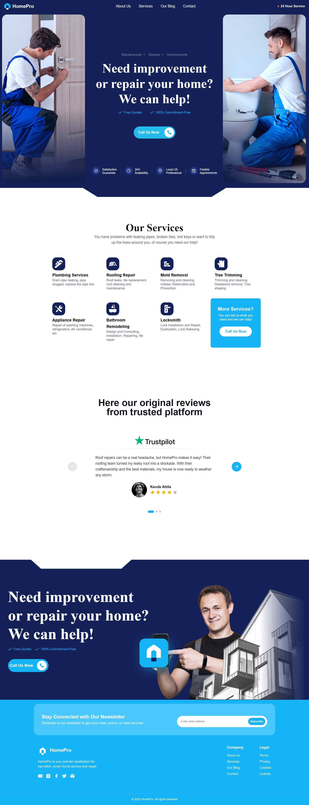

## HomePro - Static Website  
## [Live Link](https://bhupendra-maurya.github.io/homePro/)


## Overview  
**HomePro** is a responsive and visually appealing static website built using HTML, CSS, and JavaScript. The website provides an elegant interface to showcase services, testimonials, and other essential details.    

---

## Features  

✅ **Responsive Design** – Designed with **mobile screens (375px width)** in mind for optimal user experience.
✅**Hero Section** – Includes a captivating banner with images and a call-to-action button.  
✅ **Services Section** – Highlights the various services offered by HomePro.  
✅ **Testimonials Section** – Displays customer feedback using a dynamic slider.  
✅ **Footer Section** – Contains contact details, social media links, and a newsletter subscription form.  

---

## Technologies Used  

- **HTML5** – Structuring the webpage content.  
- **CSS3** – Styling the layout and ensuring responsiveness.  
- **JavaScript (ES6)** – Adding interactive features and functionality.  

---

## Installation  

To set up the project locally, follow these steps:  

1. **Clone the repository**:  
   ```sh
   git clone https://github.com/Bhupendra-Maurya/drupal-assignment

   - open in your code editor
   - cd <your dir name>
   ```
2. **Open the `index.html` file** in a web browser to view the website.  

---

## Usage  

- Simply open `index.html` in a modern web browser such as **Chrome, Firefox, Edge, or Safari**.  
- Customize the **content and styles** in `style.css` and `index.html` as needed.  
- Modify `script.js` to enhance the website's interactive features.  

---
# Mobile View

## NavBar
